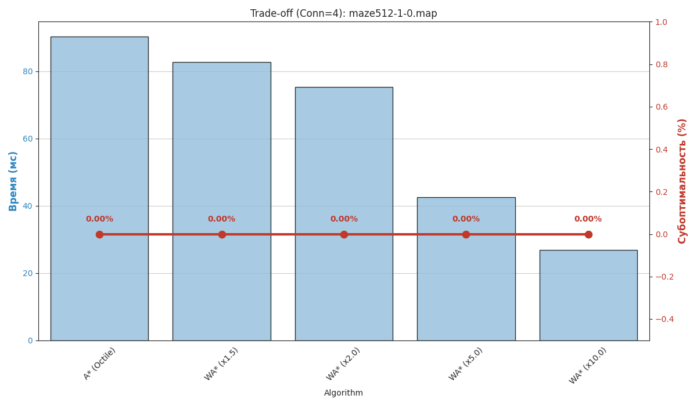
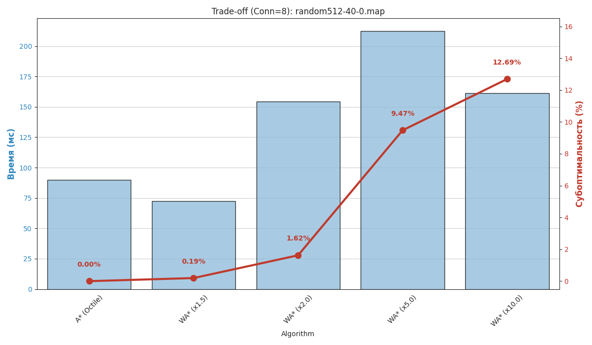

# Grid Pathfinding Benchmark
---

## Постановка задачи

**Цель** проекта - разработать производительную систему планирования пути на двумерном сеточном графе (2D grid-graph) для одного агента.

**Реализация:**
- **Алгоритмы:** Реализация классических алгоритмов поиска: BFS, Dijkstra, A* и Weighted A* (WA*).
- **Эвристики:** Поддержка Манхэттенского, Евклидова и диагонального (Octile) расстояний. Для WA* требуется поддержка настраиваемого веса эвристики w≥1.
- **Связность графа:** Поддержка 4-связных и 8-связных графов. Для 8-связных сеток строго реализован запрет срезания углов (corner cutting) — диагональный переход разрешен только если обе ортогональные клетки свободны.
- **Архитектура:** Вычислительная логика реализована на C++ для достижения высокой производительности. Обвязка, управление экспериментами и визуализация реализованы на Python с использованием pybind11 для связи двух языков.
- **Бенчмаркинг:** Автоматизированное тестирование алгоритмов на стандартизированных картах и задачах из набора MovingAI Benchmark. Система собирает и сравнивает метрики: длина пути, время планирования, количество раскрытых вершин (expanded nodes) и субоптимальность (для WA*).

---

## Оглавление

1. [Установка и Сборка](#установка-и-сборка)
    - [Требования](#требования)
    - [Пошаговая установка](#пошаговая-установка)
2. [Подготовка данных](#подготовка-данных)
3. [Запуск и Использование](#запуск-и-использование)
    - [1. Режим visual (Визуализация)](#1-режим-visual-визуализация)
    - [2. Режим bench (Быстрый Бенчмарк)](#2-режим-bench-быстрый-бенчмарк)
    - [3. Режим exp (Эксперименты)](#3-режим-exp-эксперименты)
    - [4. Аналитика и Графики](#4-аналитика-и-графики)
4. [Конфигурация](#конфигурация)
5. [Алгоритмы и Эвристики](#алгоритмы-и-эвристики)
6. [Результаты и Метрики](#результаты-и-метрики)
7. [Структура проекта](#структура-проекта)
---

## Установка и Сборка

### Требования
- **OS**: Linux / macOS
- **C++**: Компилятор с поддержкой C++17 (GCC/Clang)
- **CMake**: 3.10+
- **Python**: 3.8+
- **Libs**: `pybind11`, `pandas`, `matplotlib`, `seaborn`

### Пошаговая установка

1.  **Установка Python-зависимостей:**
    ```bash
    pip install -r requirements.txt
    ```

2.  **Сборка C++ модуля:**
    ```bash
    mkdir build
    cd build
    cmake ..
    make
    cd ..
    ```
    *Успех: в папке `build/` появится файл `pathfinding_core.cpython-*.so`.*

3.  **Быстрая настройка (опционально):**
    (Если есть скрипт `setup.sh`, он прописан):
    ```bash
    chmod +x setup.sh
    ./setup.sh
    ```
4.  **Активация виртуального окружения:**
    ```bash
    source venv/bin/activate
    ```

---

## Подготовка данных

Проект использует формат карт `.map` и сценариев `.scen` (MovingAI).
Файлы должны лежать строго в папке `data/`, разделенные по типам задач (папкам).

**Правильная структура:**
```text
data/
├── map/                  # Папка карт
│   ├── maze/             # Тип "maze"
│   │   └── maze512-1-0.map
│   └── random/           # Тип "random"
│       └── random512-10-0.map
└── scen/                 # Папка сценариев
    ├── maze/
    │   └── maze512-1-0.map.scen
    └── random/
        └── random512-10-0.map.scen

```

**Скачать карты можно здесь: [MovingAI Benchmarks](https://movingai.com/benchmarks/grids.html)**

Можно так же создать свои карты и сценарии, сохраняя структуру как в других примерах
(В репозиторий положу только несколько карт и сценариев, чтобы не засорять папку `data/`).

---

## Запуск и Использование

В проекте реализована **единая точка входа** через скрипт `scripts/main.py`.
Все команды запускаются из **корневой директории** проекта.

Общий синтаксис:
```bash
python3 scripts/main.py <РЕЖИМ> [ПАРАМЕТРЫ]

```

Доступные режимы:

1. **`visual`** — Визуализация работы алгоритма (ASCII + PNG).
2. **`bench`** — Быстрый тест производительности в консоль.
3. **`exp`** — Массовые эксперименты и сбор данных в CSV.

Параметры:
1. Записаны в файле `config.py`. Можно изменять и они будут применены по дефолту. Смотрите значения по умолчанию заранее в конфиге.
2. Все параметры можно указать в аргументах команды. Аргументы переопределяют значения из `config.py`.
---

### 1. Режим `visual` (Визуализация)

Используйте этот режим, чтобы детально изучить, как алгоритм строит путь на конкретной задаче. Скрипт нарисует карту в консоли и сохранит изображение `path_viz.png`. (Каждую новую визуализацию скрипт перезатирает изображение 'path_viz.png'. Если необходимо, то сохраняйте копию отдельно.)

**Параметры:**

- `--map <путь>`: Путь к файлу карты (.map). от ./data/map
- `--scen <путь>`: Путь к файлу сценария (.scen). Если задан, задачи берутся из него. от ./data/scen
- `--id <int>`: Номер задачи в сценарии (по умолчанию 0).
- `--algo <str>`: Алгоритм. Доступны: `bfs`, `dijkstra`, `astar`, `wastar`.
- `--limit <int>`: Проиграть N задач подряд (режим "слайд-шоу").

**Примеры:**

- **Случайные точки на карте:**
*(Если сценарий не указан, старт и финиш выбираются случайно)*
```bash
python3 scripts/main.py visual --map data/map/maze/maze512-1-0.map --algo astar

```


- **Конкретная задача из сценария:**
*(Запуск задачи №5 на карте из сценария с алгоритмом WA*)*
```bash
python3 scripts/main.py visual --scen data/scen/maze/maze512-1-0.map.scen --id 5 --algo wastar

```


- **Просмотр нескольких задач подряд:**
```bash
python3 scripts/main.py visual --scen data/scen/random/random512-10-0.map.scen --limit 5

```


---

### 2. Режим `bench` (Быстрый Бенчмарк)

Используйте этот режим для быстрой проверки работоспособности кода. Он прогоняет список алгоритмов (настроенный в `config.py`) по сценариям и выводит таблицу результатов прямо в терминал.

- обязательно сначала загрузите необходимое кол-во карт в data, иначе это бесполезно.

**Параметры:**

* `--limit <int>`: Ограничение количества задач на один сценарий (по умолчанию 10).

**Пример:**

```bash
python3 scripts/main.py bench --limit 20

```

---

### 3. Режим `exp` (Эксперименты)

Режим для сбора статистики, для дальнейшего построения графиков и подсчета метрик. Скрипт запускает масштабное тестирование, перебирает карты и сохраняет результаты в CSV файлы в папке `results/`.

! Внимательно прочитайте `scripts/config.py`. Тестирование сложных сценариев занимает много времени. Необходимо проверить тестируемые алгоритмы, 4-8-связность графа и количество задач.

**Параметры:**

- `--mode <str>`: Стратегия выборки задач из сценариев. (Обычно остортированы по возрастанию сложности.)
    - `uniform`: (Рекомендуется) Берет задачи равномерно по сложности (короткие, средние, длинные).
    - `first`: Берет первые N задач.
    - `all`: Прогоняет ВСЕ задачи из файла (Долго. Рекомендуется запускать отдельно, при уверенности в правильности настроек).

- `--count <int>`: Количество задач для тестирования на одной карте (по умолчанию 100). 

- `--map <str>`: Фильтр по имени карты. Если указать (например, `random512-10-0.map`), тесты пройдут только на ней. (в конфиге указано через EXP_TARGET_MAP. по умолначнию)

**Примеры:**

- **Стандартный запуск с параметрами из `config.py`:**
```bash
python3 scripts/main.py exp

```


- **Глубокое тестирование одной карты:**
*(Прогнать абсолютно все задачи на карте random512)*
```bash
python3 scripts/main.py exp --map random512-10-0.map --mode all

```


- **Быстрый "прогревочный" тест:**
```bash
python3 scripts/main.py exp --mode first --count 10

```

**Сохранение данных**

Данные сохраняются в папке `results/` в виде CSV файлов.
```text
results
├── maze                  # Для каждого типа карты своя папка
│   ├── first_10          # Каждый запуск создает свою подпапку с CSV
│   └── single_map_tests 
└── random
    ├── first_10
    └── single_map_tests
```
- сначала попадает в тип задачи
- потом в тип тестирования по 1 карте или множественным
- файлы с названии содержат временную метку

---

### 4. Аналитика и Графики

После того как вы запустили режим `exp` и получили CSV файлы, используйте этот скрипт для построения графиков.

**Команда:**

```bash
python3 scripts/analyze_results.py

```

Скрипт автоматически:
- Найдет все CSV файлы в папке results/.- 
- Построит 6 типов графиков (Время, Вершины, Длина, Trade-off, Scatter plots).- 
- Сохранит текстовый отчет (_report.txt).

Обратите внимание:
- временная метка дублируется от названия файла CSV.
- если по csv файлу уже был построен график, то он не пересоздается.
    - чтобы пересоздать необходимо запускать скрипт с аргументом `--force`
    - внимание. это перезапишет все графики по существующим CSV файлам.
- для 8-связности не строятся графики bfs, так как он учитывает диагональ длиной 1, а не корнем из 2


## Конфигурация

Файл `scripts/config.py` управляет режимом `bench` и общими настройками:

- общие настройки
    - CONNECTIVITY ( для визуализации и тестирования bench)
    - MAP_TYPES (названия типов карт. необходимо добавить при добавлении новой карты)
- настройки запусков --mode
    - visual
    - bench
    - exp
- настройки алгоритмов
    - ALGO_REGISTRY
    - EXPERIMENT_ALGORITHMS

---

## Алгоритмы и Эвристики

### Реализованные алгоритмы:

- **BFS**: Поиск в ширину. Оптимален на графах без весов.
- **Dijkstra**: Гарантированно находит кратчайший путь.
- **A\* (A-Star)**: Направленный поиск. Использует эвристику . Оптимален.
- **WA\* (Weighted A\*)**: $f(n)=g(n)+w⋅h(n)$, где $w>1$
    - Жадная реализация A*.
    - Работает (скорей) быстрее A*, но не гарантирует оптимальность (чем больше константа, тем больше может терять в оптимальности маршрута)


### Эвристики:

- Zero: h(n)=0. Превращает A* в Dijkstra.- 
- Manhattan: $∣x_1​−x_2​∣+∣y_1​−y_2​∣$. Для 4-связных графов.- 
- Euclidean: $(x_1​−x_2​)^2+(y_1​−y_2​)^2$​.- 
- Octile: $max(Δx,Δy)+(\sqrt2​−1)min(Δx,Δy)$. Для 8-связных графов.

---

## Результаты и Метрики

### 1. Измеряемые метрики

Для каждого запуска алгоритма фиксируются следующие данные:

- **Time (ms):** Время выполнения поиска пути.
- **Expanded Nodes:** Количество раскрытых вершин (показатель эффективности эвристики).
- **Path Length:** Длина найденного пути.
- **Suboptimality (%):** Отклонение найденного пути от оптимального (для взвешенных алгоритмов WA* и Greedy). (для сценариев, где задана оптимальная длина пути)

### 2. Структура результатов

Скрипт аналитики генерирует следующие файлы:- 
- *_report.txt: Сводная таблица средних значений.
- *_1_time_avg.png: Сравнение среднего времени работы.
- *_2_nodes_avg.png: Сравнение количества раскрытых вершин (log scale).
- *_3_length_avg.png: Сравнение средней длины пути.
- *_4_tradeoff.png: График компромисса "Скорость vs Качество" (для WA\*, A\*).
- *_5_scatter_time.png: Зависимость времени от длины пути (Scatter Plot). 
- *_6_scatter_nodes.png: Зависимость раскрытых вершин от длины пути (Scatter Plot).

### 3. Основные наблюдения

**Смотреть результаты в папке results.**

**Краткие выводы на основе тестирований:**
- Ожидаемо, A\* работает быстрее и раскрывает меньше вершин. Так же WA\* при увеличении канстанты жадности так же уменьшает время и раскрываемые вершины.
- На разных типах карт наблюдается разное относительное поведение алгоритмов:
    - На лабиринтах WA* алгоритмы почти не теряют в оптимальности, так как у нас всего мало путей.
    - На random картах же просадка оптимальности WA*10 доходит до 15% на сложных сценариях.
- Иногда WA\* с бо`льшим коэффициентом проигрывает по времени и числу раскрытых вершин. Возможно, из-жа жадной переоценки и рассматривания плохих путей.

Для сравнения график tradeoff.png для карты лабиринтов, случайных, улиц (maze, randomб street)



---

## Структура проекта

```text
.
├── build/                  # Бинарные файлы (C++ .so)
├── src/                    # Исходный код C++
│   ├── PathPlanner.cpp     # Ядро алгоритмов
│   ├── PathPlanner.h       # Заголовки
│   └── bindings.cpp        # Связь с Python
├── scripts/                # Скрипты Python
│   ├── main.py             # Точка входа (visual/bench/exp)
│   ├── run_experiments.py  # Скрипт массового тестирования
│   ├── analyze_results.py  # Построение графиков
│   ├── config.py           # Настройки
│   ├── map_parser.py       # Чтение .map/.scen
│   └── visualizer.py       # Рисование
├── data/                   # Входные данные. Должны быть в строгом порядке
├── results/                # Результаты тестов. Файлы CSV и итоги визуализации
├── requirements.txt        # Зависимости
├── CMakeLists.txt          # Сборка проекта
├── setup.sh                # Скрипт быстрой утсановки (можно вручную)

```